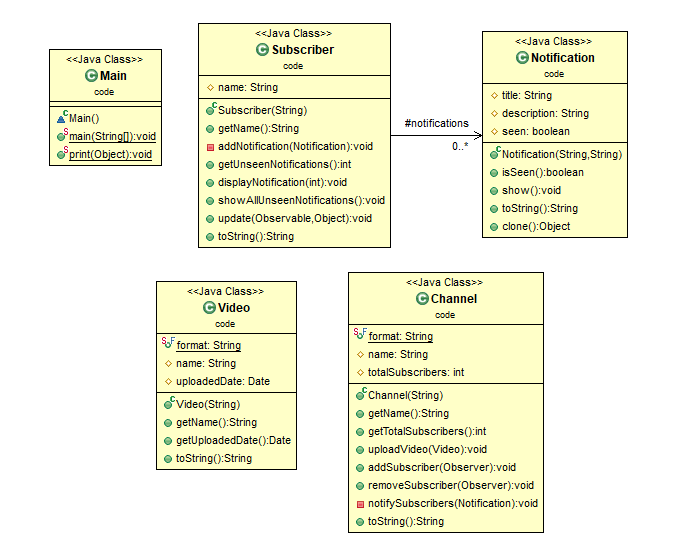
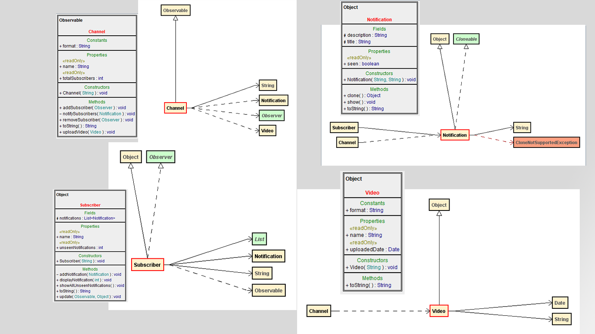

# Observer Pattern.

## Problem Before Observer in a Nutshell

## UML of Observer Design pattern.

## Description.

The intent of Observer Design pattern is to define one-to-many dependency between objects so that when one object changes state all its dependent are notified so that they can react to changes.

### another definition.

The observer pattern is a software design pattern in which an object called the subject, maintains a list of its dependents called observer and notifies them automatically of any state changes, usyally by calling one of their methods.

--- 

## Project UML Diagrams.

Class Diagram

Class Modeling Diagram.

