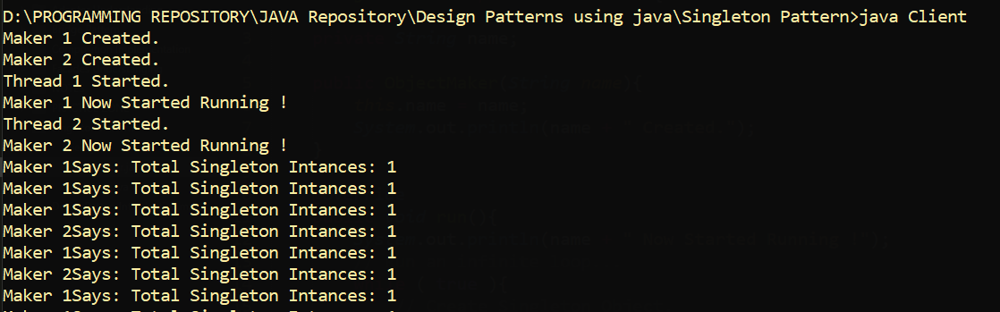

# Singleton Pattern.

## What is Singleton Pattern ? 
Singleton pattern is commonly used pattern in the softwares. It has the responsibility of creating only single instance of the Class and to provide global access to it. It comes under the category of Creational Design Pattern. It is genrally used to centralize the accessibility...

---

### Singleton class without Synchronization.

Following is the execution of singleton class without thread synchronization block.

### Singleton Class with synchronization Block 

Now with thread synchronization block.

